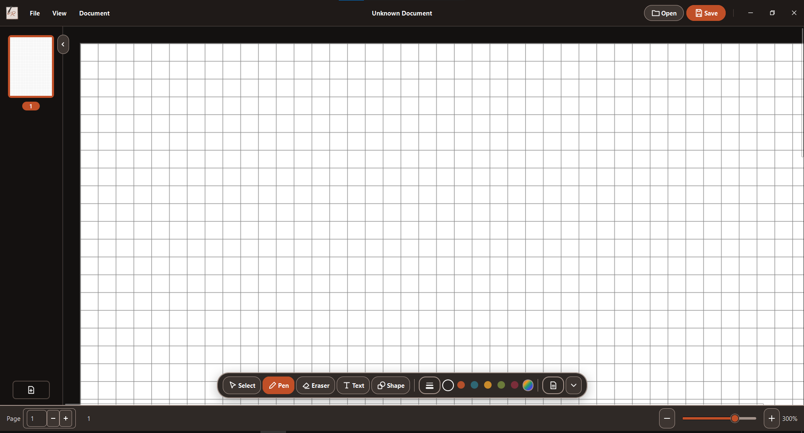

# 

## Features

RustInk is a university project created not only to experiment with concepts learned during the first and second years of the Bachelor’s degree program in Computer Science (Class L31) at Federico II University in Naples, but also to stop using software that was too slow to save files, even when documents were only a few hundred pages long.

- Graphics tablet support
- World's fastest file format based on SQLite; regardless of document size, you won't experience even a second of lag when saving
- Modern, innovative GUI
- Import/export notes as PDF files
- Create notes directly on PDFs
- Auto-backup every 10 seconds with a corresponding recovery system
- Choice of pen colors and stroke styles
- Selection of geometric shapes
- Customizable text (fonts, size, bold, etc.)
- Native cross-platform support (Linux, macOS, Windows)
- Select different backgrounds for different pages

## Installing

### Windows

Choose the correct setup for your CPU architecture and run it!

### Debian OS based

```sh
sudo dpkg -i install rustink-<version>-<distro>-x86_64.deb
```